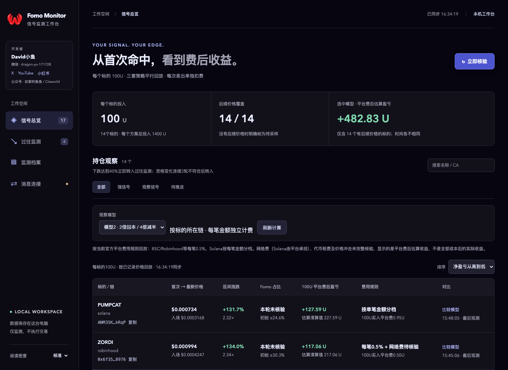
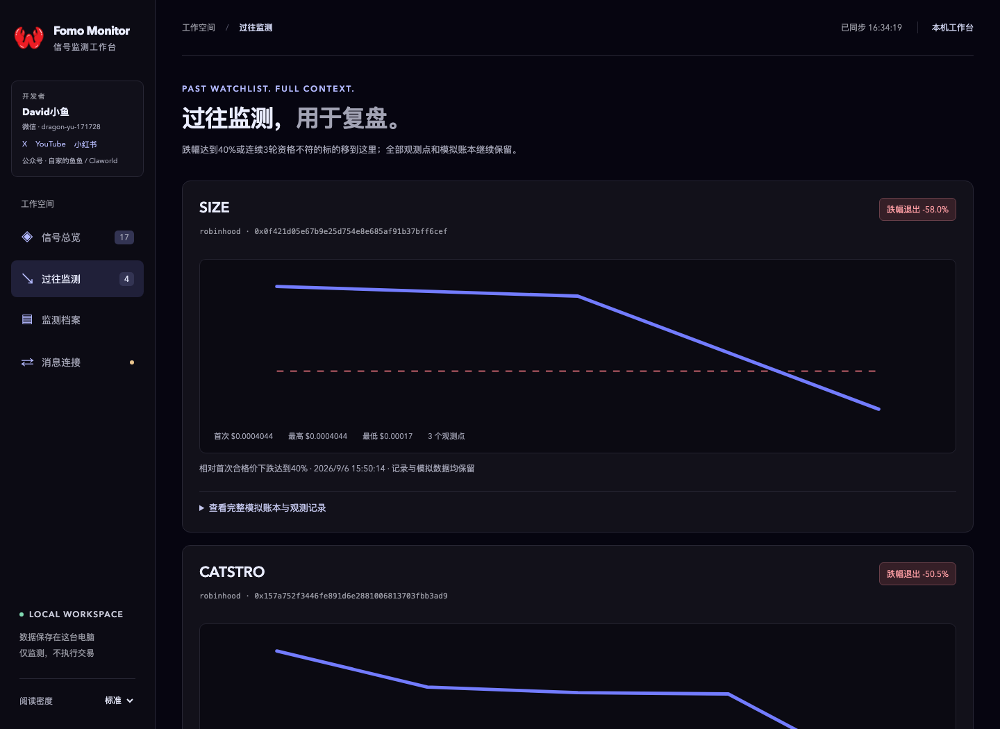
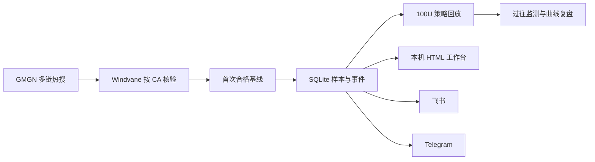

<div align="center">
  
  <h1>Claworld Fomo Monitor</h1>
  <p><strong>从首次命中，到退出复盘的本机 Fomo 信号监测工作台</strong></p>
  <p>GMGN 多链初筛 · Windvane 核验 · 100U 策略回放 · 飞书 / Telegram 推送</p>
  <p>
    
    
    
    
  </p>
</div>

> 这是一个运行在个人电脑上的观察工具。它记录真实核验结果、模拟策略和消息投递，不连接钱包，也不执行真实交易。



## 它解决什么问题

热点代币变化很快，单次截图很难回答三个问题：它何时首次符合规则、之后发生了什么、按既定策略现在结果怎样。

Claworld Fomo Monitor 把这些步骤连成一条可复盘的本机流程：

1. 从 GMGN 多链热搜寻找候选。
2. 使用 Windvane 按完整 CA 核验 Fomo 持仓。
3. 为首次合格标的建立不可覆盖的价格基线。
4. 持续记录价格、市值、Fomo 占比和生命周期样本。
5. 以每个标的 100U 回放多套策略，并按链逐笔计算平台费。
6. 新信号、风险和策略触发可同时推送至飞书与 Telegram。
7. 退出主清单后保留价格曲线、样本和模拟账本，用于后续复盘。

## 当前监测规则

| 阶段 | 条件 | 工作台行为 |
|---|---|---|
| 首次进入 | 创建 1–7 天、市值 20万–50万美元、Fomo 持仓下界 ≥15% | 登记首次合格价并高亮最新入选 |
| 观察信号 | Fomo 持仓 15%–20% | 进入观察清单 |
| 强信号 | Fomo 持仓 >20% | 标记强信号 |
| Fomo 退出 | 后续区间上界确认低于15% | 整行标红；全部模拟策略按首次触发价清仓剩余仓位 |
| 价格退出 | 相对首次合格价下跌达到40% | 立即停止重点跟踪并转入“过往监测” |
| 资格变化 | 年龄、市值或 Fomo 资格不再符合 | 连续3个有效核验轮次不符合后转入“过往监测” |
| 数据受阻 | 登录、配额、来源故障或关键数据缺失 | 不推进失败轮次，避免误移出 |

Windvane 区间跨越15%时视为不确定，不触发清仓信号。所有退出都只改变展示和模拟状态，不删除 SQLite、事件或 Markdown 历史。

## 过往监测与复盘



“过往监测”独立保存：

- 首次、最高、最低和最后观测价格
- 非连续行情的全部真实采样点
- 40%价格退出线和触发时间
- 四个100U策略分支的模拟交易、剩余仓位和逐笔平台费
- 原始 CA、链、数据来源和观测备注

## 三步在本机运行

### 1. 获取项目

```bash
git clone https://github.com/David0936/claworld-fomo.git
cd claworld-fomo
```

### 2. 安装本机服务

```bash
python3 monitor/install.py
```

安装脚本会将运行文件部署到 `~/Library/Application Support/FomoMonitor/`，创建 macOS LaunchAgent，并启动只监听本机的服务。

### 3. 打开工作台

双击 `打开Fomo监控台.command`，或访问：

```text
http://127.0.0.1:8765/
```

关闭网页不会停止后台推送。电脑关机、主动睡眠或退出系统后无法继续监测；Codex 与所需行情网站应保持可用和登录状态。

## 飞书与 Telegram

工作台的“消息连接”页面可以同时启用两个通道，每个通道独立记录发送状态和失败重试。

### 飞书群机器人

1. 飞书群 → 设置 → 群机器人 → 添加自定义机器人。
2. 将 Webhook 粘贴到工作台。
3. 如启用签名校验，同时填写签名密钥。
4. 保存并点击“测试飞书推送”。

群机器人方式无需 App ID、App Secret 或 OAuth。高级设置仍保留企业自建应用登录与个人推送。

### Telegram

1. 通过 [@BotFather](https://t.me/BotFather) 创建机器人并取得 Bot Token。
2. 在工作台保存 Token。
3. 点击“Telegram 登录 / 绑定本人”。
4. 打开机器人、点击 Start，再回到工作台完成验证。

也可以直接填写 Chat ID。私聊使用数字 ID，群聊通常是负数 ID，频道可使用 `@频道用户名`。

## 100U 模拟策略

每个标的从首次完整核验合格点独立投入100U。三个模型平行计算，不能把它们的本金或收益相加。

| 模型 | 规则 |
|---|---|
| 模型1 · Fomo 留存 | 按 Fomo 留存条件观察退出 |
| 模型2 · 2倍回本 | 首次观察到2倍时净收回100U；后续观察到4倍时卖出剩余仓位的一半 |
| 模型3A · 2.5倍滚动 | 首次观察到2.5倍时净收回100U，其余继续观察 |
| 模型3B · 2.5倍滚动 | 首次观察到2.5倍时净收回110U，其余继续观察 |

任何模型只使用当时已经记录的数据，不用之后行情倒填此前未观察到的成交。Fomo 占比确认低于15%或价格达到40%退出线时，会按规则清仓全部剩余模拟仓位。

详细口径见 [100U 模拟观察说明](monitor/PORTFOLIO.md)。

## 手续费口径

当前回放采用 [Fomo 官方手续费说明](https://help.fomo.family/en/articles/14436214-trading-fees-on-fomo)：

| 链 | 平台费 |
|---|---|
| BSC / BNB、Robinhood、Base、Monad、Ethereum | 每笔0.5%，网络费另计 |
| Solana | `<5U` 固定0.10U；`5–47.5U` 为2%；`47.5–190U` 固定0.95U；`≥190U` 为0.5% |

每次分批卖出按当笔金额重新计费。未取得可靠证据的网络费、代币税、池费、滑点和价格冲击会明确标为“未核验”，不会假设为零。因此页面展示的是平台费后估算结果，不是全部成本后的真实盈亏。

## 数据和运行结构



- 服务地址：`127.0.0.1:8765`
- 运行目录：`~/Library/Application Support/FomoMonitor/`
- 本机配置：`data/config.json`，保存权限为600
- 事件与样本：`data/monitor.sqlite3`
- LaunchAgent：`~/Library/LaunchAgents/club.local.fomo-monitor.plist`
- 自动化对接：[monitor/INTEGRATION.md](monitor/INTEGRATION.md)
- 可复用监测提示词：[monitor/automation](monitor/automation)

配置、凭证、数据库和服务日志均在 `.gitignore` 中，不应提交到公开仓库。不要把本机8765端口转发到公网。

## 更新与测试

工作台每6小时检查仓库中的 `VERSION`，只提示新版本，不会自动覆盖本机代码、数据库或连接凭证。

```bash
git pull
python3 monitor/install.py
cd monitor
python3 -m unittest discover -v
```

更新内容见 [CHANGELOG.md](CHANGELOG.md)。

## 开发者

**David小鱼**

- 微信：`dragon-yu-171728`
- 公众号：自家的鱼鱼 / Claworld
- X：[@Shark1996_](https://x.com/shark1996_)
- YouTube：[@Singularity2026](https://www.youtube.com/@Singularity2026)
- 小红书：[David小鱼](https://xhslink.com/m/6WBQosGc8F6)

---

如果这个项目对你的观察和复盘有帮助，可以在 GitHub 点一个 Star。它能让更多人找到这个本机工具。
